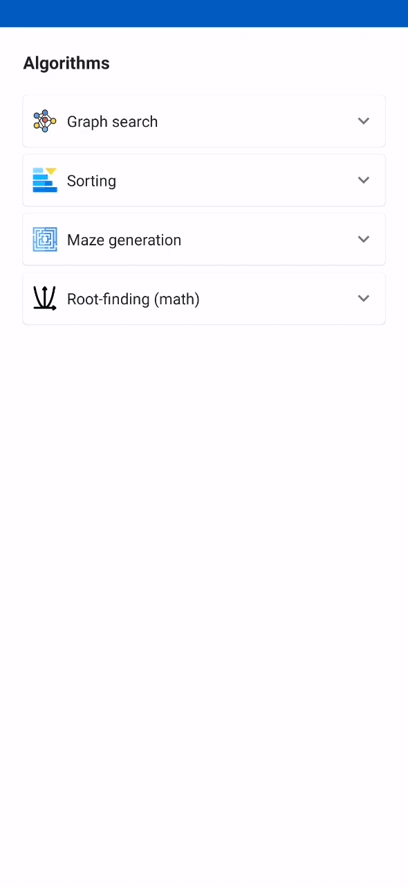
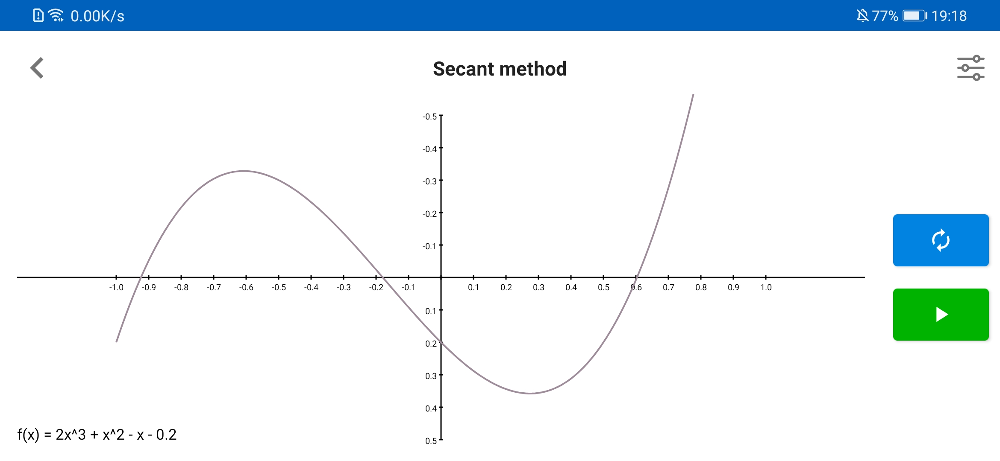

# GoAlgo
An Android app for visualizing algorithms with animation.

## [Algorithms](https://en.wikipedia.org/wiki/List_of_algorithms)

- Graph search
  - [x] [BFS](https://en.wikipedia.org/wiki/Breadth-first_search) 
  - [x] [DFS](https://en.wikipedia.org/wiki/Depth-first_search) 
  - [ ] A*
  - [x] [Dijkstra's](https://en.wikipedia.org/wiki/Dijkstra's_algorithm) 
  - [ ] [Floyd-Warshall](https://en.wikipedia.org/wiki/Floyd%E2%80%93Warshall_algorithm) 
  - [ ] [Bellman-Ford](https://en.wikipedia.org/wiki/Bellman%E2%80%93Ford_algorithm) 
  
- Sort
  - [x] Bubble sort
  - [x] Insertion sort
  - [x] Merge sort
  - [x] Quick sort
  - [x] Selection sort
  - [x] Shell sort
  - [x] Cocktail shaker sort
- [Maze generation](https://en.wikipedia.org/wiki/Maze_generation_algorithm)
  - [x] Randomized DFS
  - [x] Randomized Kruskal's
  - [x] Randomized Prim's
  - [x] Recursive division

- [Root-finding](https://en.wikipedia.org/wiki/Root-finding_algorithms) (math)
  - [x] [Secant method](https://en.wikipedia.org/wiki/Secant_method)
  - [x] [Steffensen's method](https://en.wikipedia.org/wiki/Steffensen%27s_method)
  - [x] [Inverse interpolation](https://en.wikipedia.org/wiki/Inverse_quadratic_interpolation)

## Screenshots

### Graph search

#### Breadth-first search (BFS)

#### Depth-first search (DFS)

#### Dijkstra's algorithm

### Sorting algorithms

#### Quick sort

#### Bubble sort

#### Insertion sort

#### Selection sort

#### Merge sort

#### Shell sort

#### Cocktail shaker sort

### Maze generation

#### Randomized DFS

#### Randomized Kruskal's

#### Randomized Prim's

#### Recursive division

### Root-finding (math)

#### Secant method

#### Steffensen's method

#### Inverse quadratic interpolation

### All view is responsive, and customizable (change animation speed, change color)

## Credits

- 
Icons made by <a href="https://www.freepik.com" title="Freepik">Freepik</a> from <a href="https://www.flaticon.com/" title="Flaticon">www.flaticon.com</a>

